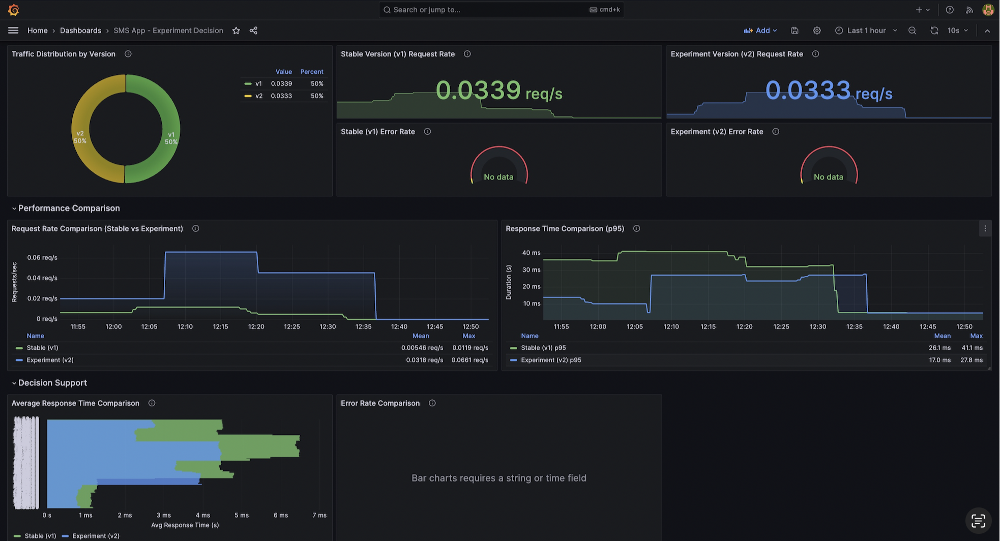

# Continuous Experimentation: A/B Testing Strategy

## Hypothesis
We hypothesize that modifying the Call-To-Action (CTA) on the SMS Checker landing page (v2) will act as a stronger cue for users, leading to a higher engagement rate compared to the original design (v1). Specifically, we expect a **5% increase in prediction requests** from users exposed to the v2 variant.

## Metrics
To validate this hypothesis, we will monitor the following Prometheus metrics exported by our application:

1.  **Primary Metric (Engagement):** `sms_app_requests_total{status="200"}`
    -   We compare the rate of successful prediction requests between `variant="v1"` and `variant="v2"`.
    -   Since traffic is split 90/10, we normalize the v2 count by multiplying by 9 to compare against v1, or look at the ratio of `predictions / page_views` (if page views were tracked separately). For this experiment, we look for a significant proportional increase in v2 usage.

2.  **Guardrail Metric (Performance):** `app_http_request_duration_seconds`
    -   We must ensure that the v2 changes do not introduce any latency regression.
    -   We monitor the 99th percentile latency (`histogram_quantile(0.99, rate(...))`) to ensure it remains steady.

## Decision Process
The experiment will run for a fixed duration (e.g., 1 hour or 1000 requests).

1.  **Analyze Results:**
    -   Compare the normalized prediction volume of v2 vs v1.
    -   Check latency graphs for anomalies.
2.  **Decision Criteria:**
    -   **PASS:** If v2 shows a statistically significant increase in predictions (> 5%) AND latency is largely unchanged (within 5% margin). -> **Promote v2 to Stable**.
    -   **FAIL:** If v2 shows no improvement, fewer predictions, or higher latency. -> **Rollback to v1**.

## Access & Traffic Split
* **Stable host (v1 default):** `sms-app.example.com`
* **Experimental host (v2 only):** `experimental.sms-app.example.com`
* **Split:** 90% v1 / 10% v2 in `app-virtualservice` (configurable via `istio.trafficSplit.*`).
* **Sticky sessions:** `DestinationRule` hashes on `x-user-id`. Keep the same header value to stay on the assigned version.

## How to Test (curl / Postman)
1) **Hit stable host (mostly v1, sticky by user id)**
```bash
curl -H "Host: sms-app.example.com" \
     -H "x-user-id: demo-123" \
     http://<INGRESS_IP>/
```
Repeated calls with the same `x-user-id` should stay on one version (v1 most likely).

2) **Force v2 via experimental host**
```bash
curl -H "Host: experimental.sms-app.example.com" \
     -H "x-user-id: demo-999" \
     http://<INGRESS_IP>/
```
All requests should hit app-v2; sticky hashing ensures reloads stay on v2.

3) **Check metrics scraping**
```bash
curl -H "Host: sms-app.example.com" http://<INGRESS_IP>/sms/metrics
```
Verify `variant="v1"` and `variant="v2"` counters grow as expected.

## Observing Results in Grafana
* Port-forward Grafana (replace namespace/release if needed):
```bash
kubectl port-forward svc/doda-sms-app-grafana 3000:3000
```
* Open `http://localhost:3000`, load dashboard **“SMS App – Experiment Decision”**.
  * Panels to watch: request rate v1 vs v2 (`sms_app_requests_total`), p95 latency (`app_http_request_duration_seconds`), error rate.
* Screenshot reference: `images/experiment.png`.

## Prometheus Integration
* Metrics exposed at `/sms/metrics`; discovered via `ServiceMonitor` (see Helm chart).
* Grafana dashboard JSON: `helm/dashboards/dashboard-experiment.json`.

---


