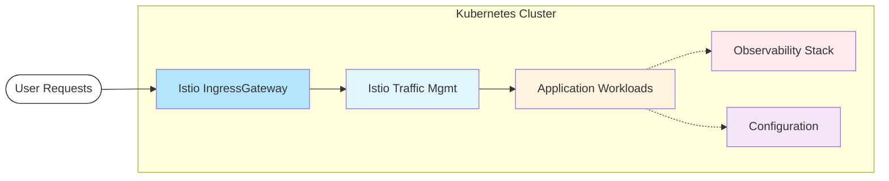
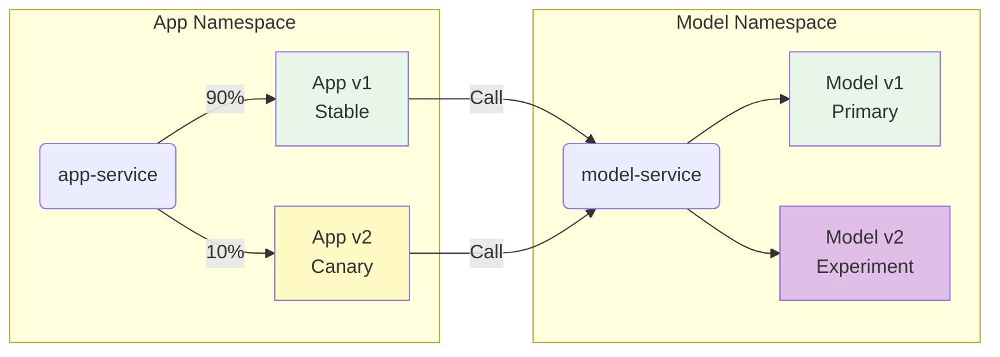
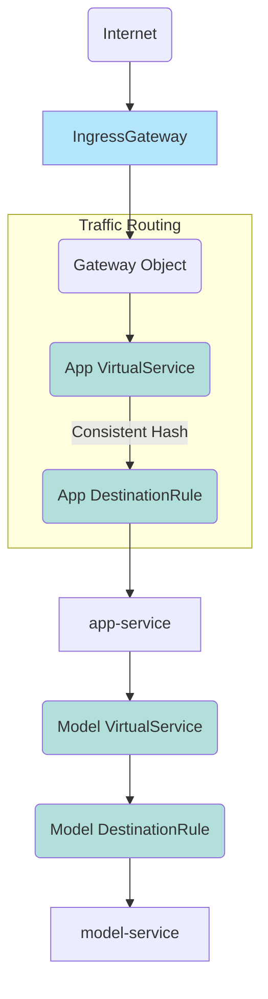
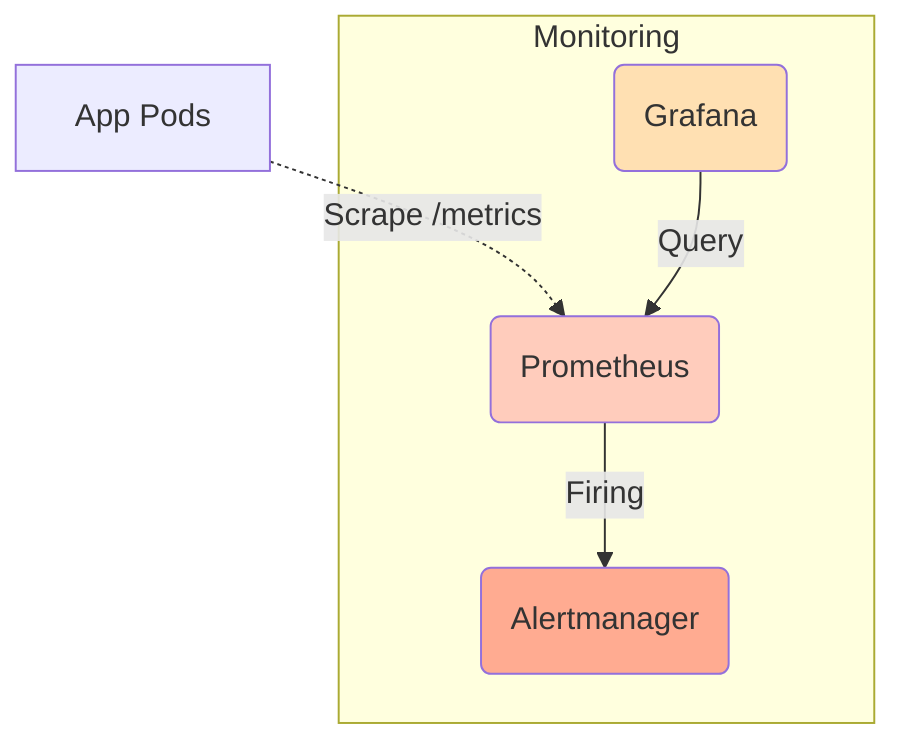
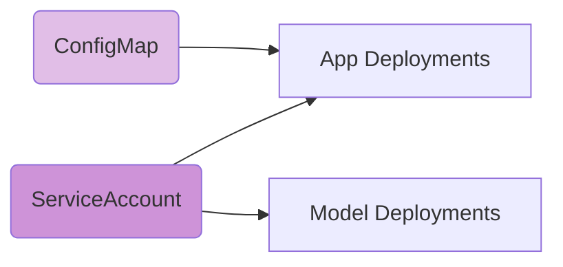
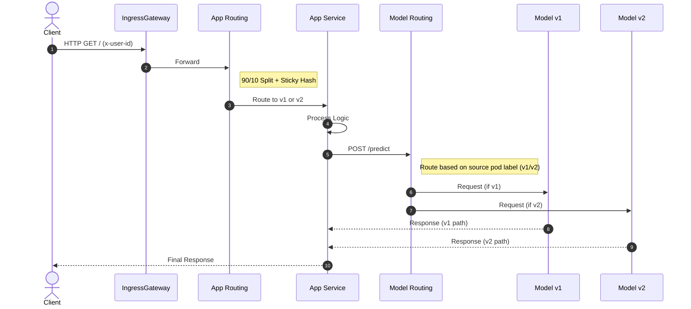
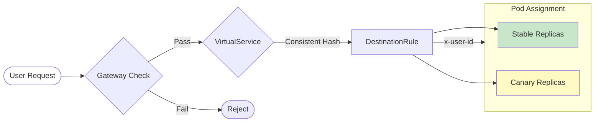

# Deployment Documentation

## 1. Deploying the Application

### Prequisites
*   Minikube running with 4 CPUs and 8GB RAM (`minikube start --cpus 4 --memory 8192`).
*   Istio installed on the cluster.
*   `kubectl` and `helm` installed.

### Installation Steps
To deploy the application components, run the following command from the `operation/helm` directory:

```bash
helm install doda-sms-app . --values values.yaml
```

This will provision:
*   **App Services**: `app-service`, `model-service`.
*   **Deployments**: `app-v1`, `app-v2`, `model-v1`, `model-v2`.
*   **Istio Resources**: `Gateway`, `VirtualService`, `DestinationRule`, `EnvoyFilter` (rate limit).
*   **Rate Limit Infra**: ratelimit service + Redis in `istio-system` (per-user quotas).
*   **Observability**: `ServiceMonitor`, `PrometheusRule`, `Grafana` dashboards.

---

## 2. Deployed Components

The deployment consists of a Kubernetes-based microservices architecture managed by an Istio Service Mesh. The system is divided into several logical layers:

#### High-Level System Overview



### Application Services
*   **app-service (ClusterIP):** The main entry point for the backend logic. It sits in front of the application pods.
    *   **app-deployment (stable):** Runs the `v1` version of the code. Handles ~90% of user traffic.
    *   **app-deployment (canary/experiment):** Runs the `v2` version of the code. Handles ~10% of user traffic for A/B testing.
*   **model-service (ClusterIP):** The internal machine learning service.
    *   **model-deployment (primary):** Serves predictions for the stable app (v1).
    *   **model-deployment (experiment):** Serves predictions for the experiment app (v2).

#### Application Services and Deployments



### Istio Data Plane
*   **Istio IngressGateway:** An Envoy proxy load balancer that sits at the edge of the cluster, receiving all external HTTP traffic on port 80.
*   **VirtualServices:** Define the routing rules (e.g., traffic splitting).
*   **DestinationRules:** Define properties of the upstream clusters, such as consistent hashing for sticky sessions.

#### Istio Traffic Management Layer



### Observability Stack
*   **Prometheus:** Scrapes metrics from the application pods (via `ServiceMonitor`) and Istio sidecars.
*   **Grafana:** Visualizes metrics (request rates, latency, custom business metrics) on pre-provisioned dashboards.
*   **Alertmanager:** Handles alerting rules (e.g., high error rates).

#### Observability Stack Diagram



### Configuration Resources

#### Configuration Resources Diagram



---

## 3. Request Flow

The life of a request flows through the system as follows:

### Typical Request Path (UI / Predict)

1.  **External Entry:** A user sends an HTTP request to the configured host (default `sms-app.example.com`). The **Istio IngressGateway** intercepts this request.
2.  **Traffic Split (App Layer):** The Gateway forwards the request to the `app` VirtualService.
    *   **Decision:** The VirtualService checks the configured weights (90% vs 10%).
    *   **Sticky Session:** It checks the `x-user-id` header. If present, consistent hashing ensures the user stays on the same version they were assigned to.
    *   **Result:** The request is routed to either an `app-v1` pod or an `app-v2` pod.
3.  **Internal Service Call:** The application processes the request. When it needs a prediction, it makes an HTTP POST request to `http://model-service:8081`.
4.  **Route Matching (Model Layer):** The `model-service` VirtualService intercepts the call.
    *   It inspects the **source pod label** `version` (set on app deployments).
    *   **If v1 source:** Routes to the `model-v1` subset.
    *   **If v2 source:** Routes to the `model-v2` subset.
    *   **Result:** Strict isolation is maintained (no old-new mixing).

### Request Data Flow

The following sequence diagram illustrates the complete request flow from client to services, including routing decisions:



---

## 4. Canary Routing and Sticky Sessions

We implement a **Canary Release** strategy to test `v2` safely.

### Decision Logic
The routing decision is taken by **Envoy at the Istio IngressGateway**, not by application code.
*   **Routing Split**: Approximately 10% of users are routed to the canary subset, while 90% go to stable.
*   **Sticky Sessions**: The `DestinationRule` applies **consistent hashing** on the `x-user-id` HTTP header. This ensures that repeated requests with the same identifier are routed consistently to the same pod version (subset), providing a seamless user experience.

#### Canary Routing Decision Flow



---

## 5. Additional Istio Use Case (Selected): Per-User Rate Limiting

We implement **per-user rate limiting** using an EnvoyFilter at the Gateway plus a dedicated ratelimit service.

### Implementation Details
*   **Mechanism:** `EnvoyFilter` injects `envoy.filters.http.ratelimit` into the Gateway listener (GATEWAY context).
*   **Backend:** `doda-sms-app-ratelimit` service with Redis backend (one replica each) deployed to `istio-system`.
*   **Granularity:** Per **x-user-id** descriptor; current budget: **8 requests/min per user**.
*   **Helm toggle:** Controlled by `istio.rateLimit.enabled` (defaults to true).

---

## 6. External Access

The application is exposed externally as follows:

*   **Hostname (stable):** `sms-app.example.com` (configurable via `istio.gateway.host.stable`).
*   **Hostname (experimental):** `experimental.sms-app.example.com` (configurable via `istio.gateway.host.experimental`).
*   **Ports:** HTTP **80** (exposed via Istio IngressGateway).
*   **Paths:**
    *   `/`: Frontend web application.
    *   `/predict`: Prediction endpoint.
    *   `/metrics`: Prometheus metrics.
*   **Headers:** `x-user-id` (used for deterministic routing).

---

## 7. Observability

*   **Prometheus**: Scrapes metrics from `/sms/metrics` via `ServiceMonitor`.
    *   *Rules*: Includes `HighRequestRate` alerts (`PrometheusRule`).
*   **Grafana**: Pre-configured dashboards (ConfigMap) visualize:
    *   Request Rates (Golden Signals).
    *   v1 vs v2 Business Metrics (Conversion Rate).
*   **Alertmanager**: configured to route alerts (e.g., to email or webhook).
